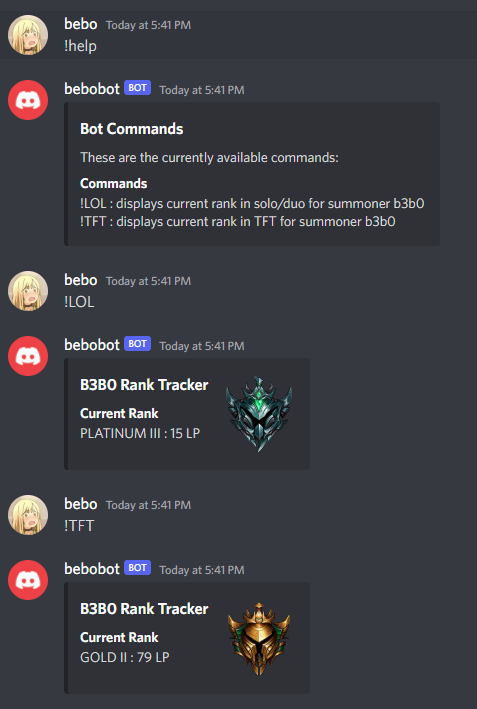

4.10.2022

_Demo of bebobot commands_

> you can find the github documentation for this project [here](https://github.com/b-fang/bebobot)

## What is bebobot?

bebobot is a discord bot that currently tracks the rank of summoner b3b0 (me) in both ranked solo/duo and tft. The purpose of this bot is rather meaningless,
but the project serves as my introduction into the riot and discord APIs.

## A first look at the riot api and discord bots

As I continue to document and build out a portfolio for Riot Games and Game Development as a whole, I wanted to take some time to familiarize myself with the
Riot API. As a precursor to future projects, understanding the documentation will be important in my ability to create my own data sets which can then be used for a
variety of analytical purposes. Overall, the main purpose of this project is to outline the following:
 - Demonstrate a general familiarity with scripting langauges (ie. python), an important skill set for game designers at Riot.
 - Understand the Riot API documentation through this simple example to prepare for future M.L. / Data Analysis projects on League of Legends data sets. 
 - Work with discord bots and the Discord API because it's fun!

## The Riot API

For this bot, I needed to pull my own summoner data from the league-v4 API as well as the tft-league-v1 API. These interfaces allow me to request the main data points that I'd like to display:
 - my current LP
 - my current Tier ('PLATINUM', 'DIAMOND', etc.)
 - my current Rank ('I', 'II', 'III', 'IV')

To do so, a Riot API key is necessary for authentication. The general use process for the [riot API](https://developer.riotgames.com/docs/portal#_getting-started) can be found here.
Additionally, the RiotWatcher library was used out of convinience. More info about [RiotWatcher](https://riot-watcher.readthedocs.io/en/latest/) can be found here.

For this project, a summoner object that stored the requested data given by the riot API was utilized. Since the league-v4 API returns a set object that includes other
data points like 'summonerID' and 'leagueID', the set must be parsed for the specifics of my project (LP, Tier, and Rank). These data values are stored and later passed to the discord API.

_It is important to note that set object requested contains both data for solo/duo and flex. It is a good idea to double check that you are extracting the correct value._

## Integration with Discord

Integration with discord is a rather straight forward process outlined in their own discord.py documentation, but I'll reiterate the main the steps for this project.

First, a discord token is necessary to establish an environment connected to the discord API. You can find the general process for [discord](https://https://discord.com/developers/docs/intro) here.

Next, you simply write the functionality of the commands that you'd like the bot to have. In the case of this project, the written commands are as follows:
 - !LOL : Displays the current rank of b3b0 in solo/duo as an embeded message with rank emblem thumbnail.
 - !TFT : Displays the current rank of b3b0 in tft as an embeded message with rank emblem thumbnail.
 - !help: Displays context of all available commands 

## Future Extensions

A natural extension for this project would be to plot LP over time and add it as a field to the embeded Discord Message or to allow the discord command to specify the summoner. These would require 
the implementation of either new or changed bot commands. Since I'd rather move onto other projects, I'll leave these as incomplete for now. if I ever feel it is necessary, I'll try to add this functionality.

