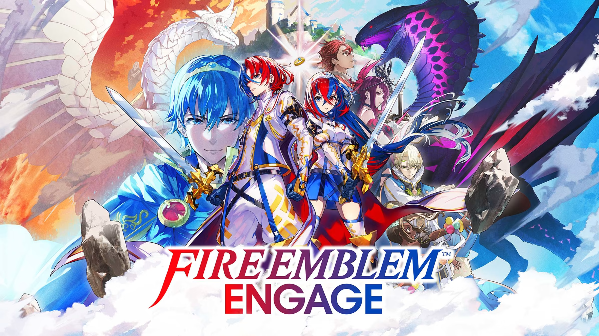
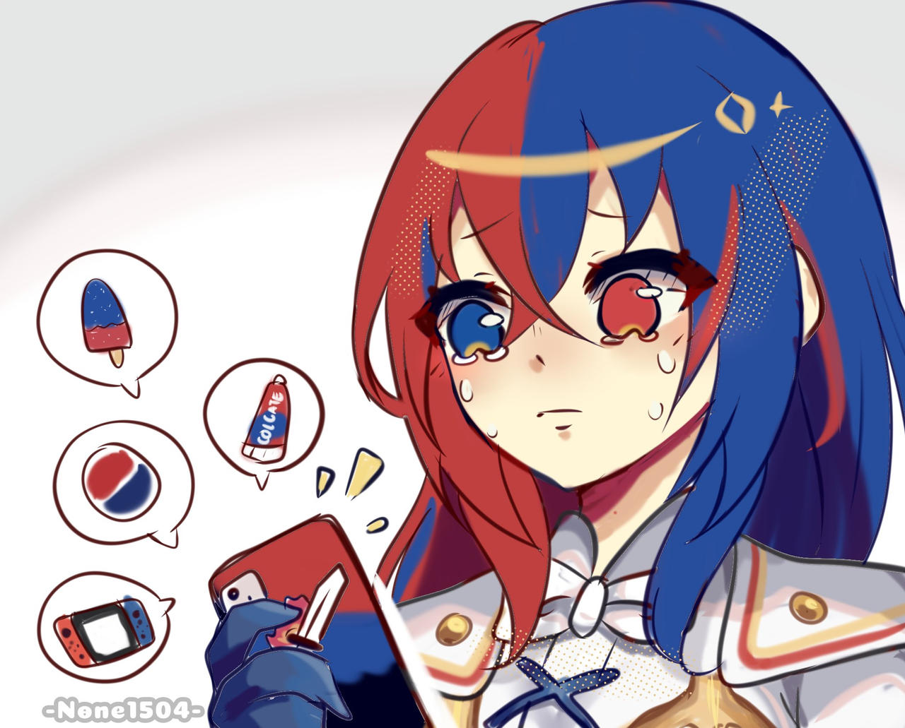

_You can find the Nintendo Direct Trailer [here](https://www.youtube.com/watch?v=3ExaJIB5Phk)_

## Purpose

After my last post regarding the design of the player experience, I wanted to apply my thoughts and understandings in the 
context of Fire Emblem. Primarily, I'd like to focus on:

 - Analysis of gameplay mechanics in relation to player agency
 - Community reception of design choices

# Fire Emblem Engage

On September 13th, 2022, Nintendo released its first trailer for the next mainline Fire Emblem game in 3 years. Titled as 
_Fire Emblem Engage_, it features a new protagonist with red and blue hair, Alair, and the unexplored region of Elyos, 
threatened by the return of the Fell Dragon. Although the trailer is quite short, as a massive Fire Emblem fan, I wanted to 
take a look at some of the gameplay mechanics to both test my design intuition and hype my excitement. I think this post 
could be a great exercise in interpreting design choices, especially through the lens of player experiences as that's what 
trailers are meant to appeal to.

## Impressions

I don't think there is a great way to organize my thoughts other than just to bullet out my thoughts based on the chronology 
of the trailer. To follow along, just open up the trailer!

 - The leading graphic shows a return of nostalgic main characters from old titles. I think this is a choice, both as a way of 
 appealing to the largely aging FE community and newer audiences who will be inspired to experience the older titles (which 
 are fantastic btw).
 - FE has always had notable soundtracks, and so far FE17 seems like this trend will continue. I like the return of the 
 orchestral theme, drawing on that grandiose that always shines through FE titles.
 - In the first frames of gameplay, it seems that the weapon durability has been removed. This has always felt like an 
 annoying mechanic so I'm glad to see it's removal. As a design, it made players hord strong weapons, and I've always disliked 
 this disincentive.
 - Graphically, everything seems a lot more polished. In comparison to older titles, I think the anime style helps give a lot 
 of clarity to map, which is greatly appreciated (along with the the new UI display). 
   - There is also a clear and nonintrusive infographic of battle turn order, which was not clear and could cause problems in 
   player decision making from older titles. This is great.
 - The weapon triangle has returned, which I've always found as a great additional strategic layer in FE. Although the exact 
 implementation of the mechanic is still unclear, I'm glad to see it.
 - The stereotyical "Jagen" archetype has returned. This is often an early promoted unit that is given to the player to help 
 navigate hard early maps. Personally, I am not a fan of this design choice. Often this constricts the player to use a 
 character that is locked into this build, limiting their choices for their party. I do see aspects of this design choice 
 being postive, however. It makes a lot of sense to help newer players (especially with FE's expanding player base) and 
 also gives flexibility specifically for helping other units grow.
 - The pair up mechanic has been replaced with a Bond system. Although a lot of the details remain unclear, I'm a little 
 disappointed as a fan of FE14. From a design stand point, I do like this new system more though. FE14 was not balanced with 
 pair up, and Intelligent Systems chose an entirely different route compared to reworking something niche. 

## Community Reception

_from None1504 on [deviantArt](https://www.deviantart.com/none1504/art/Alear-s-meme-Fire-Emblem-Engage-930766723)_

Any trailer analysis is incomplete without a look at the immediate reception from fans and players. Understanding audience 
perceptions is important from growth and flexibility, so FE should be treated on differently. 

On that note, I think it is important to transition into talks about "Toothpaste-chan". As an emergent meme since the leaks 
for FE17 around June, the red and blue hair of the new protagonist has been tastefully made fun of as branding for Colgate. 
Personally, although this reception is quite harsh, I can't help but agree. Character design of this form is at the very 
least polarizing, and I don't think boldness is a quality good for self-insert main characters. Although the game is not yet 
playable, I hope there is a least some story mechanic for this design choice, as it seems quite random at the moment.

For other aesthetic design choices (I'm really no expert in this area but I think it's at least important for me to consider), 
the more anime-esque overall art style has been received with mixed attitudes. I personally believe that it is a step in the 
right direction, as it feels more inclusive to the current climate of pop culture and styles. It feels more minimal and clear, 
which I can also appreciate from a gameplay and visual clarity perspective.

As for other story design components, I'm not sure too much else can be said. The overarching story line has had mostly 
postive reception, as nothing too detailed has been released, and the return of nostalgic characters is certainly a plus. 
Fire Emblem fans often rave about their favorite title (mine personally being FE14 - Conquest), and I think returning to 
those roots as a side implementation is a good way of bringing back those elements while also steering the game in a new 
direction. I share a lot of the sentiments of the community in this regard. 

Finally, as for the reception of the teased gameplay mechanics, the growth of the player base and the shift to more modern 
mechanics feels great. I think the designers made great choices in regard to my persepctive of what a FE title "should be", 
although this does come with the exclusion of casual players in some respects. The removal of divine pulse (undoing decisions) 
makes every player phase feel more impactful, but it takes away from players who may not want such hardcore experiences and 
just want to experience the story and the character arcs. I hope that the difficulty tiers can compensate for this well. 
The return of casual mode (without permadeath) and lunatic mode would be great for both types of players. 

## Final Thoughts / Further Readings

Overall, I'm extremely excited for this new title coming in January of 2023. Although I'm a bit dissatisfied with some of the 
choices made by the game designers, I think I can understand their thought processes and intentions well. At the very least, 
the title seems very modern, with great approachs to both player conveniences and agency. Fan favorite mechanics have returned 
while outdated mechanics have seen iteration. As a player, I can't ask for much more!

As my last note, I'd like to leave a link to the impressions of one my favorite FE youtubers, [Zoran](https://pastebin.com/GKWqfivT). 
You can find his youtube channel [here](https://www.youtube.com/user/Zoran501). I was actually inspired by his content to 
talk about my own thoughts and write this post. Check out his channel if you want great content on detailed FE strategies 
and also perspective on the passion in the Fire Emblem community. Since I'm someone who cares a bit more about gameplay design over 
story building, I'd love to be able to be a designer who can appeal members of gaming communities like him the most -- members 
who are deeply passionate about pushing the limits of what players strategize. 
