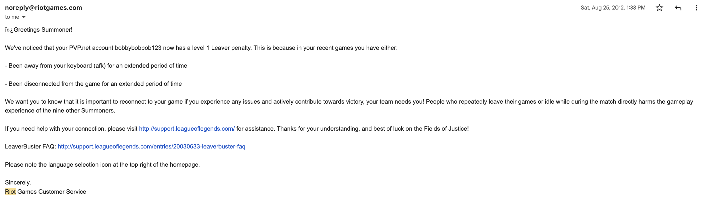

I started playing League of Legends over 10 years ago towards the end of season 2; I was 11 years old and in 6th grade. At that point, 
I would certainly be classified as a “casual” gamer. I had never seen or participated in a competitive esport prior, and to that end, 
League really opened my eyes to a whole new dimension of gaming. 

Early on, I never really took the game too seriously, but that quickly changed once I hit level 30. Some of my fondest memories from that time 
included quickly walking home to queue ranked and listening to Scrillex and Warriors (by Imagine Dragons). As cringe as it may sound, I’d get 
myself really hyped up off the vibes, and I was eventually awarded with Platinum 5 in my first season of ranked. From then on I’ve largely plateaued, 
though in more recent years I believe it to be more of a lack of effort than a comparable skill difference. Regardless, League has really crept into my life, 
becoming a part of my identity as a gamer. 

Soon, I’ll be graduating college, and saying goodbye to my childhood. I will be applying to various positions in my career field, and moving 
on to different things. Yet, I still feel a bit unsatisfied with where I’m heading. I’m afraid of making a mistake with where my life is going. I don't want 
the regret of never giving this part of my life a fair shot.

So I’ve decided to make a decision. This is my declaration to make at least one genuine and solid attempt at a career in a field, company, and community that 
has already given so much to me. The following outlines my plan for the next month to become a competitive candidate for a game design internship at Riot.

- Reach Diamond in Solo Queue (prior Plat. 1 Peak).
- Reach Masters in TFT (prior Grandmaster Peak - 505 lp).
- Create detailed posts outlining my thought process and ability to think about these game modes at a high skill level.
- Demonstrate the translatability of an engineering skill set as an asset in game design.
- Analyze and Study Game Design content with respect to Riot values in building player first experiences.
- Suggest new and creative mechanics utlizing design principles to embody a 'dare to dream' mindset.
- Show proficiency in fields important to Game Design at Riot (ie. scripting languages, interpreting analytics)

> Summoner Name : b3b0 - [current LOL rank](https://www.leagueofgraphs.com/summoner/na/b3b0) , [current TFT rank](https://www.leagueofgraphs.com/tft/summoner/na/b3b0)

_One of my earliest emails from Riot Games in 2012. This account is no longer in use, as I later switched to my new summoner name_