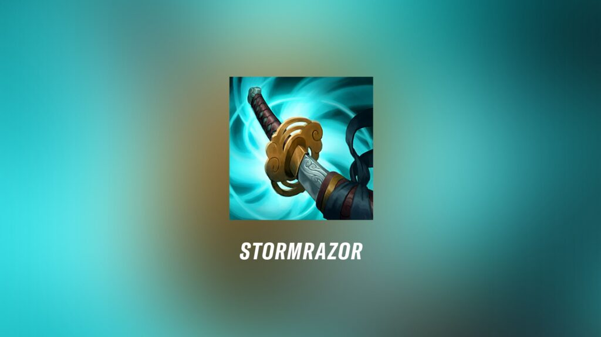

**Author’s Note: After play testing this build, I can now confidently say it is quite bad. Although the points that I make aren’t moot, it 
becomes incredibly hard to put into practice. However, Galeforce + Fleet still feels quite bad: I ended up preferring either Galeforce + 
Dark Harvest or Eclipse + Fleet (mostly the later option). I think this speaks a lot towards the importance of checking damage calculators 
and play testing. At the very least I think this was a good exercise in thinking about trade offs in itemization choices. Read on at your 
own risk, this is not recommended to try at home. 

*Additional Context: This accounts for the state of LoL prior to the patch 12.14, although testing was done late patch 12.17/18. 

_what a beautiful item..._

# First Item Stormrazor Jhin

The implementation of the durability patch (12.10) has drastically changed the meta game of the LOL competitive scene. The 2022 LCK spring 
titans, SKT, have been unable to maintain their undisputed dominance in Korea, as top lane tank roles have become more prevalent; Zeus has 
been forced to take a backseat away from a carry top role that allowed SKT to exert unmatched topside pressure. Consequently, the value of 
the ADC role has increased, especially with the return of prized enchanter supports (Yuumi/Lulu) and late game hyper carries (Sivir, Zeri, 
Aphelios). 

Naturally, ADC’s that do not conventionally fit this build of “high attack speed” / “high mobility” carries have fallen a bit out of play. 
Jhin, notoriously known for having a fixed attack speed and lacking great forms of mobility (being one of the only ADC’s to actively purchase 
swiftness boots to compensate for a lack of a dash), is one such example*. This has made Galeforce an enticing mythic choice, giving a 
fantastic stat spread, a movement speed mythic passive, and powerful reposition active. However, I believe that Jhin must make fundamental 
adjustments away from the conventional to fit the new style of League that is being played to be able to reemerge as a top tier pick. My 
answer: First Item Stormrazor Jhin. 

> *Side Note: Jhin also receives reduced benefit from Berzerker’s given his innate AA mechanics, but Boots + 4 pot item starts before the 
health pot and time warp tonic nerfs still suggests the importance of movement speed over flat stats (the pick rate of boots start is 
actually still 60% from op.gg as of 12.17). I personally still prefer this start in many bot lane match ups.

Historically, first item Stormrazor has not been seen since before the item rework of Season 11, likely with some small exceptions for 
Tristana and Caitlyn where the item’s innate synergy with their respective champion kits makes the item feel natural. In the case of Jhin, 
records from probuilds and op.gg show near 0% usage, with particular respect to Stormrazor as a first item option. Without 1300 gold on a 
first back, you’d be unable to purchase the BF sword component, which can significantly hinder early game lane states. In comparison, unstable 
lanes with conventional Jhin builds at least have Long Sword + 3 Pot starts that both give ample amounts of sustain and a 350 gold head start 
into Noonquiver or Dirk (for Eclipse Mythics). It can be hard to give up the flexibility of cheap breaking points with AD giving components 
when comparable Stormrazor builds must settle for components like Kircheis and Crit Cloak at such gold thresholds (which are horribly gold 
inefficient and give weaker stats). Additionally, the overall gold efficiency of Stormrazor is quite bad (95.37% compared to Galeforce’s 100%). 
In such conditions, I’d also generally advise against this build in such cases. Of course, in even and winning lane states the story is 
completely different. 

Stormrazor provides something that conventional Jhin builds lack: A strong and cheap one item power spike, a great item passive that 
synergies with Jhin’s natural play-style and kit, alternative rune choices, and finally (in the case of Eclipse builds) 20% crit that 
still goes towards third item IE. 

## Early Game Power Spike

First item power spikes are extremely important in early dragon stacking and fights. Jungle pathings for bot lane and early game bot side 
invades are some clear indicators of this trend*. As play has become more centered around this objective, which spawns at 5 minutes but is 
more frequently contested around the 7-8 minute mark, it becomes possible to reach the Stormrazor spike before an enemy ADC acquires their 
mythic in even matchups. Even in the cases in which the first dragon is not contested, lane swaps around this time can become common from 
first herald spawn, where early gold influxes from plating can be defining for future game states. Overall, the price of stormrazor should 
not be underestimated. In snowballing match ups, it makes it easier to push leads.

> Side Note 2: An interesting example is from week 3 of the Summer 2022 LCK: GenG vs KDF (on Patch: 12.11). Peanut playing as Poppy 
flashes over the dragon pit to avoid wards and steals Elim’s bot side reaching level three. Combined with an early winning bot lane, 
they are able to pull off an insane hex flash gank against the KDF bot lane. In addition to looking at the bot lane match up, bot lane 
priority is valued heavily. [Clip from Caedrel Stream](https://www.youtube.com/watch?v=FWLjexE4lmg)

## Jhin Synergies

When considering the stat spread of Stormrazor, its low gold efficiency is balanced through its powerful passive, which provides a 75% slow 
for 1 second and 120 bonus damage on hit. In the case of Jhin, this is extremely powerful due to his special auto mechanic, which loads his 
trading into individual slow shots. The difference in trades of getting 1 vs. 2 autos is massive, and being able to weave in and out of enemy 
AA range is important. Naturally, adding a slow to his first auto enables both of these aspects of his kit, where the slow can guarantee Jhin 
the flexibility of when to start and end trades. Referencing season 11 statistics, Stormrazor saw this type of early game play as by far his 
best first item option for this reason. 

## Alternative Rune Choices

Fleet Footwork (FF) has been Jhin’s defining rune choice for the majority of season 12, giving movement speed (which Jhin always appreciates) 
and sustain in lane. The drawback to this keystone, however, is that it also means that Jhin is unable to take advantage of more damage 
oriented keystones. Here, I believe that Dark Harvest is incredibly powerful, giving Jhin upwards of 200 damage in later stages of the game 
with his fourth shot. The natural synergy with Jhin as a non-sustained damage ADC but rather a burst/follow-up/execute champion makes this 
extra damage feel great in closer fights. Additionally, with starting item options like long sword + 3 pot or Boots + 4 pot and the rune taste 
of blood, Jhin can still compensate for the loss of FF sustain.

## 3rd Item Power Spikes 

The largest drawback of lethality builds for ADC's has always been the delay of Infinity Edge (IE). As a third item power spike, IE has always 
been a defining moment for when ADC's really start to come online, and any delay in its acquisition can hurt the overall game state for up to 
3 to 5 minutes. In the case of Jhin, Eclipse as a mythic option gives lethality and % armor penetration, giving more raw damage compared to 
Galeforce. However, this delay of IE can mean the difference in an important midgame teamfight. 

The solution lies in first item Stormrazor, where you are still building towards a third item IE while having the option to itemize into Eclipse 
afterwards. Gaining the lethality means more overall damage, and picking up mythics later means harder spikes from the legendary passive. 

## Concluding Thoughts

Despite it's low gold efficiency, I think that stormrazor first item Jhin currently is in a state where it can shine. Under the right game circumstances, 
Jhin is able to capitalize on these synergies and the current meta game to be at least a mid tier pick. 

 

