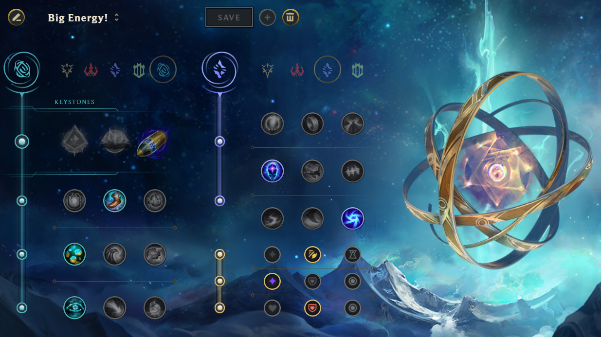
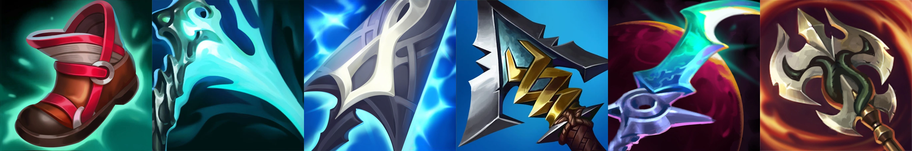

> Update (10.10.22): During the Group Stage of Worlds 2022, EG actually played this build in their match against DK (with small rune modifications). I feel vindicated. ~~I also feel like a genius~~.
I'm a humble person.

  

# Purpose

Analyze the kit of one of my favorite champions and show an alternative and optimal build that is not commonly used. 
Demonstrate a high level understanding of the different league mechanics (runes/summoner spells/gameplay) in said analysis.

# Eclipse + First Strike + TP Ezreal

The issue with Ezreal has always been his early laning phase. Although your level 1 and 2 are quite good, the period from 
levels 3-9 can feel quite bad until you acquire your 2 item powerspike. Since, those levels account for the bulk of the 
laning phase, this becomes a genuine issue at higher levels of play, where just picking Ezreal means forgoing any bot lane 
priority from draft. 

For Ezreal to be good, I think it is better to just accept this fact. This means fully committing to his inherit lane safety 
for a build that optimizes his abiliy to scale. ie. Eclipse + First Strike + TP Ezreal.

## The Build

After my last post regarding Stormrazor Jhin, I think I learned a lot about the short comings of my approaches to these 
builds. This especially comes to light in two main criteria:
 - In Game Feel
 - Damage Calculation Comparisons

In terms of in game feel, it is important for me to actually be play testing these ideas. There is a practical side to 
how certain game states will actually play out, and although theory can carry significant weight, it cannot ever be the 
end all be all. 

In terms of damage calculations, I made poor presumptions about what does bigger damage without really going into details 
and finding the exact values. I think this step is important to see exactly what you are giving up or gaining at 
different break points. 

With this post, I plan on addressing both of these criteria. 

### Rune Choices

I think the first thing I should talk about are the runes that go with this Ezreal Build. In the inspiration tree, along 
with first Strike, I recommend taking magical footwear, future's market, and cosmic insight. The secondary tree is often 
socrery, where I believe transcendence and gathering storm are also strong options. I will go into more detail for these 
choices in a later section.

_It should be noted that there should be flexibilty for different match ups. Manaflow and biscuits should especially 
be considered for harder early games_

### Itemization

Since the mythic option for this build is no longer Triforce but rather Eclipse, Ezreal should be taking a new legendary 
sheen item. This leaves you with the options of Essence Reaver and Lich Bane, where Essence Reaver just makes more sense. 
Muramana is still a staple second item choice, having a powerful passive after fully stacking, followed by Grudge for the 
slow and % armor pen, Eclipse for the sustain and tank shred, and finally a flexible last slot depending on the enemy team 
composition. A general recommendation is ravenous hydra. I will also go into damage calculation break points in the following section.

### Summoner Spells

I believe that this build opens up the option for TP as a summoner spell in many ways. Although exhaust and heal can 
strong alternatives in certain match ups, I intend to fully justify TP's benefits.

## Justifications

### Runes

Starting first with the runes once again, first strike fits perfectly with the intended playstyle. The goal here isn't to 
win lane. It is simply to survive until you have items and become more useful than the enemy ADC. Additionally, since the 
damage from essence reaver is front loaded in comparison to triforce (where auto weaving is necessary), the 9% additional 
damage is much easier to get value out of.

Of the first row options, magical footwear is the only solid option. 300 gold and 10 additional movement speed is just a 
great rune, especially when ezreal has no use for hexflash and probably doesn't need stopwatch early.

In the second row, there is a bit a flexibility between biscuits and future's market (FM). From my testing, I have found that 
biscuits are largely unnecessary when taking TP, as you have the ability to reset whenever it feels convenient. However, 
this is largely due to the solo queue environment, where coordination is more difficult and TP can be expended more freely. 
I believe that biscuits would be better in tournament or clash settings. As for why FM is strong, hitting item 
spikes are really important for this build, and early on it can also be utilized for refillable pot. Since Ezreal builds so 
many long swords for his first two items (and does not build sustain until his 4th item), you often cannot justify purchasing refill 
without FM as you'd prefer the AD. 

In the final row, Cosmic Insight is by far the best choice. Time warp tonic nerfs have already gutted the rune for 
corrupting pot users, and approach velocity is only useful on champions who auto frequently and kite well. Often, Ezreal 
does not want to space like that, due to his short AA range.

For the secondary tree, socrery is a go to, especially as I don't see the benefits of the other trees matching up 
(an argument for precision for POM and Bloodline could be made, but I think Ezreal can forgo the lane sustain with TP). 
The first choice is transcendence. Ezreal greatly appreciates the haste, and I believe it mathematically scales the best 
(don't quote me on that though). Although Manaflow is a natural second choice that synergizes with Muramana, with TP, you 
don't run into mana issues, especially after purchasing essence reaver (which is a surprisingly early powerspike at only 
2800 gold). This is why I prefer gathering storm, which gives a lot of AD further into the game (which you are playing for), 
and competes with fully stacked Conqueror by the 30 minute mark (28.16 AD from Conqueror @ lvl 14 vs 29 AD from Gathering). 
I still find this insane. You can get the same amount of unconditional AD as a keystone with this rune. Gathering is busted. 

### Items

#### Calculations 

> Shout out to [Cr1xaliz1](https://twitter.com/cr1xaliz1) for creating and constantly updating the League of Legends Damage 
Calculator found [here](https://docs.google.com/spreadsheets/u/1/d/1NrhB6aNDLuAZv8BYQzAIPZYgXLlmXOHsoCqPxm0mfWw/edit#gid=1320445445)

> [Clip](https://www.youtube.com/watch?v=C2ONwevBEYo) from VeigarV2 who shows this concept in practice tool. See 
Gabriel S comment as well for nontroll Triforce without Essence Calc. Although Prowler's Claw comes out as mathematically 
the most damage, I have found the Eclipse passive too hard to give up against armored units (where the % max health damage 
very strong) and the extra bonus movement speed. Additionally, Eclipse give sustain with these rune choices, where in some cases 
final item ravenous isn't possible (needing maw for an akali for example). Without bloodline, I don't think prowler's is viable.

When talking about items, it's easy to break down the differences between Eclipse and Triforce. Let's consider the following scenario:
 - 100 Armor Target
 - @ or past 20 Minutes (Gathering Storm 14.4 AD, 285 gold debt from FM)
 - Max Conqueror Stacks (for Triforce Build) and First Strike Active
 - Level 13 Ezreal

At three items with (Triforce/Muramana/Grudge), one Ezreal Q will deal 461 dmg at the cost of 10383 gold. In comparison, for only 
9,850 gold and (Essence/Muramana/Grudge), one Ezreal Q will deal 484 dmg. Removing first strike (FS), and this comes out to 443 dmg per Q. 
Of Course, this doesn't consider both the gold cost difference and additional gold from future's market and FS + TP (good resets). 
@20 minutes, and accounting for these factors (from what I was able to see from play testing), FS Ezreal will usually be able to afford an additional 
Serrated Dirk (total cost of 10950 vs 10383). This changes Q dmg to 545 or 500 w/o first strike.

_At the Three Item break Point, Triforce is already out damaged by Essence w/o a mythic._

But what about full build strength? 

With (Essence/Muramana/Grudge/Eclipse/Ravenous), one Ezreal Q will deal 800 dmg (not including Eclipse Item Passive if WQ).
With (Triforce/Muramana/Grudge/Maw/Ravenous), one Ezreal Q will deal 590 dmg. The difference is disgusting large.

## Conclusions

Overall, I just don't understand the Ezreal meta with Triforce. Ezreal is a poke champion that has a different playstyle from other 
traditional ADC's. Instead of compensating for his weaknesses with Triforce, players should look to capitize on his strengths, like his 
high q damage and safe laning. The damage calculations really speak for themselves. The value of triforce just is not there in 
most cases. The number of AA's that Ezreal must make in order to compensate with Triforce is high, and often the MS from Triforce being good 
is still contingent on landing Q (which will lower the newly buffed lowered E cd), although Ezreal already has really high E uptime. Triforce does 
less damage and puts Ezreal in more danger. Don't go Triforce. Please.