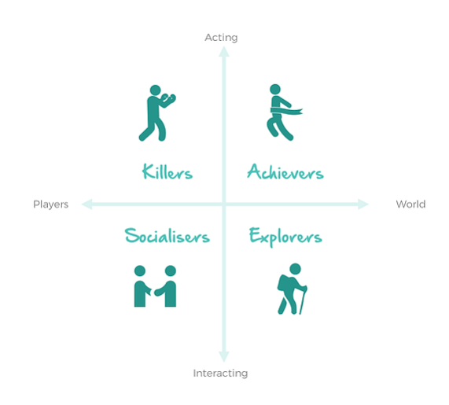

## Purpose
 
 - Understand my own short comings in the context of building experiences for players
 - Reflect on how to overcome such challenges while redefining my perspectives as assets for my own target demographics

## Player Experience 

Recently, I've been following along with the 3rd edition of _The Art of Game Design_ (2019) by Jesse Schell. 
Since the content can be quite dense at times, I wanted to take an opportunity to reflect on notable chapters that 
deserve a second look, especially as I work hard on building a stronger understanding of game design. For this post, 
I wanted to focus particularly on the player experience, and how this concept pertains to different target audiences.

I want to reflect on my own strengths and weaknesses, and better understand how my own opinions and perspectives 
will correspond with particular traits in games that I value. I think it is important that I have recognize how those 
"shoes" fit me, especially if I want to be able to tailor fruitful experiences for others. This means understanding my 
own identity and demographic as a gamer and gaging those community values.

## Audience Reception

The textbook leads with an interesting example of Albert Einstein's violin. As the guest of honor at a small organization, 
Einstein took one look at the crowd of older women, and asked if they'd prefer him to play violin rather than give a talk 
about his research. Naturally, it was the accepted idea, as the entire audience didn't really want to hear about complex topics 
they wouldn't understand. They wanted to have a shared experience with Einstein. 

I think this example speaks volumes towards understanding how players and audiences want to engage with your content, and 
how the context of both who you are as a developer and who you are as a player can be completely different worlds. For me 
personally, I've certainly had moments of "What the heck are the developers thinking!", especially in regard to Riot Games
(2017 Ardent Censer Meta still haunts me). 

With that, I'd like to speak a bit about my own short comings. As a gamer, I've always known that I've had a bit of a niche 
preference, especially in terms of what I regard as fun. I think I am deeply driven by game knowledge, and I've seen that sort 
of thought process emerge from what I value in games (good balance, flexibility, rewarded for innovation, etc.). For example, 
I've always been drawn to tactical SRPGs like _Fire Emblem_ or _Into the Breach_. Elements of these games include the ability 
to chain different gameplay elements into powerful strategies necessary for a win at higher difficulties, and I think this 
involved studying of game mechanics is fun. TFT is similar in the same way. Understanding how to pivot, and building that 
dynamic thinking process of how to play strongest board to win lobbies is more a game knowledge difference than an innate 
mechanical skill difference, and I personally feel satisfied (and would want players who play games designed by me to feel 
satisfied) by when they have outsmarted the game itself or other opponents.

Now that that context is in place, I know the audiences that I best relate to, and how alienating it can be to other demographics. 
What I consider fun is simply one dimension of player profiles, and there are other ways at which I can better understand 
their perspectives and needs.

## Player Projection

The ability to project yourself into the eyes of the player is an important skill, and having that emotional empathy comes a 
long way in game design. I believe that this is one of my strengths, especially given how I consider both myself and dynamic 
interactions with others. 

Of course, this doesn't mean this isn't something that I shouldn't take note of here again. The exclusion of demographics 
by design can certainly be prevalent, and having this as a note to look over should be helpful.

## Stereotypes and Psychological 

An interesting aspect of the textbook is this look at the innate tendencies of players to gravitate towards different goals 
in gameplay, highlighted by traits such as Mastery, Competition, Destruction, and more. I think it is this consideration of 
the lens of the player that is crutial in the success of a game designer, especially when you can know your target audience 
well and understand what type of experience they are looking for. 

Tying to those traits, I wanted to reiterate the outlines of common "Game Pleasures" that should be accounted for when 
understanding the types of gameplay experiences that you want to create. From Leblanc's point of view, I wanted to particularly recontextualize where my 
current understandings stand in regard to these themes. 

 - Sensation: The experience of playing a game is largely tied to the sensations felt throughout gameplay, and for videogames, 
 this largely comes in the form of aesthetics. 
 - Fantasy: Creating an imagination world, with fleshed out lore, can elevate the pleasure of being a part of something from 
 beyond. 
 - Narrative: The dynamic ways in which the story can unfold, giving heart to whatever tale is being told. 
 - Challenge: Problem solving and overcoming obstacles that give merit and feelings of achievement. 
 - Fellowship: Cooperation and community is a large attraction for games, and building out places in design for this to shine 
 through is important.
 - Discovery: Seeking and finding things that are new or novel give games a flare that make them otherwiser incomplete. This 
 journey is crucial in design.
 - Expression: The creation of your own experience is perhaps the most important. At the end of the day, this is how you've 
 decided to spend your time, and the ability to express yourself comes at the heart of the player experience.

## Taxonomy of Player Types

The dynamics between different player types can also be outlined by _Bartle's Taxonomy of Player Types_, where players are 
often grouped by their preferences in accordance to four main categories: Killers, Achievers, Socializers, and Explorers. I'd 
like to contextualize my own stance in these categories. I think there is a lot of importance in ones ability to assess how 
design can affect different player bases all at the same time.

 - Killers: Expressions of dominance in PvP or similar methodologies of this type of trait is defined as the Killer player type. 
 Game systems that allow for things such as spawn camping or PvP zones can be tools for this player base to feel satisfaction. 
 Personally, I don't believe I fall into this group too much, especially when I believe that a lot of situations evolve out of 
 contextual circumstances. I do believe I have a lot of familiarity with their needs, however, especially when considering solo 
 queue.
 - Achievers: Players that often pursue the in game goals fall under this group, from beating a level, getting a high score, to 
 win a game, to max exp, etc. As a designer, implementations to satisfy this group can come in forms like 100% completion modes 
 and far off awarded achievements. As a ranked grinder for nearly a decade now, I undoubtably fall under this category. The 
 pursuit of mastery is a goal I can resonate with, and I think I have no problems understanding this mindset.
 - Explorers: With the pursuit of the esoteric and new, explorers look to understand the game systems and undiscovered content, 
 where the gameplay is a tool that enables exploration. Design implementations include Easter Eggs, hidden areas, complex game 
 systems, and vast customizations. Although I do not personally have the patience to engage with such activities, I certainly 
 appreciate the efforts of the player base who pursue this kind of thinking, especially in how it ties in with the meta and 
 competitions. As a designer, I feel it is important to implement systems that are complex enough to allow players to engage in 
 this way, as it benefits the community a lot more than just that individual experience.
 - Socializers: Interpersonal aspects of games are largely appreciated by Socializers, where the community holds a lot of importance. 
 With the evolution of twitch chat and other platforms like youtube and reddit, I believe that this player base also are capable 
 of interacting with each other moreso outside of the game than in it. As a youtube frog and lurker, I 100% see the importance 
 of building communities and allowing design to benefit the player base in such ways. This is undoubtable crucial in the current 
 environment of game design.

## Concluding Thoughts

I think I have a bit a of ways to go in terms of applying these concepts practically, but I'm happy with where my understanding 
currently stands. A lot of these concepts seem fairly natural to grasp, but I think there is a complacency in that type of thinking 
as well. There big differences in being a player versus a designer, but I certainly believe that a designer cannot exist without 
also being a player with a deep love for the games they create.