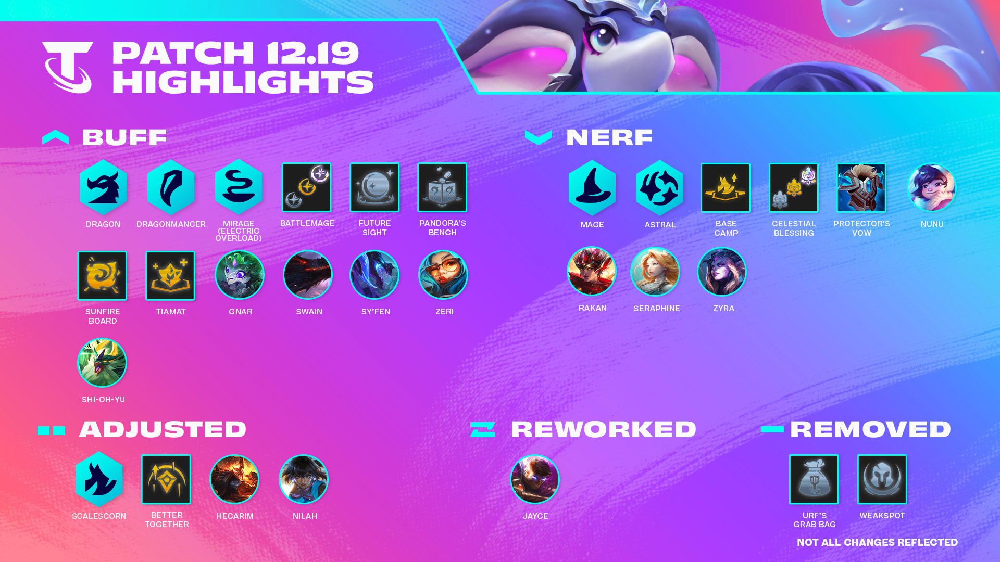

_infographic from the tft patch 12.19 update page [here](https://www.leagueoflegends.com/en-gb/news/game-updates/teamfight-tactics-patch-12-19-notes/)_

_I followed along with MortDog's usual Post Mortem Analysis [here](https://www.youtube.com/watch?v=fPbm52hzfrE). I wanted a 
place to both contextualize and branch off from, especially because I haven't had a lot of TFT experience since set 4.5._

## Purpose

- Show high level understanding of TFT mechanics relative to game design, outlining my thought processes
- Engage with the community to deepen my own understanding and help my own growth as a continue my journey to masters
- Stay up to date with TFT content and developer logs while also adding new insights.

# TFT Patch 12.19 Impressions

As of October 15th, I have finally hit Diamond in TFT. To be honest, I still don't have a great read on the meta, nor do I think 
I am "good" at TFT, but I finally feel as though I have some ground to speak on the balance of current patch. Following 
along with MortDog's usual Post Mortem developer review, I thought I'd share some of my thoughts on the patch as an exercise 
in considering more these problems and solutions that riot developers face when trying to balance TFT.

## Shi-Oh-Yu + Sy'fen

The developer review started off by discussing the new comp that emerged with 12.19: Jade/Whispers with Shi-Oh-Yu and Sy'fen. 
From my own experience, I have found that this comp went along with a lot of what they had to say: You could easily stablize 
at lvl 7 and roll. I found that starting swords off first carousel just feels so comfortable and flexible, as there are many 
items that fit really well with the composition. Additionally, item components didn't feel super contested, which is extremely 
good in the cases that you are able to win streak early. For context, chain vest or negatron cloak are almost always available 
if you are last on carousel, which can become EoN, Titan's, or BT respectively. I feel that almost every item component is very 
strong with this composition except for rod, which is often rerollable with reforger or decent on a slot in Jayce/Soraka.

Overall, the ability for this composition to easily stablize with 1 stars at level 7 as well as no reliance of a 5 star dragon 
for a first place makes it a bit too powerful for a composition that can often first the lobby. 

## Front Line Karma Dragonmancer

Another Composition that MortDog quickly touched on, especially for being a lot of fun, was the front line Karma 3. I actually 
found this composition to be very balanced from my own play testing, and I enjoyed the difference in playstyle that it brings. 
I like how it is actually very difficult for this composition to become a first without 8 dragonmancers, which is alreayd difficult 
to hit since you need at least 2 spatulas, which makes sense for a reroll comp that is strong during the middle stages. The 
inherit strength of a 3 start one cost should not carry over into stages 6/7, which has make me really enough where this 
composition currently stands. I don't feel it is unfair to play against, and I don't feel it is weak either. Just a lot of fun!

## Astral Changes

The next subject that was touched upon was the Astral changes: tldr; more gold, less astral units. Although I did not personally 
get to really play astrals that much during 12.18, I do believe that this change has been good for the meta. The current state 
of 12.19 sees astrals a strong opener when you really just want to have a strong econ before transitioning into a new composition 
at 8, or sticking through it when you find asol. By curving 3 star astrals later into the game but instead providing gold, it 
takes away from the compositions strengths during the midgame, helping the early game become more dynamic and less afk (as mentioned 
in the rundown).

I don't have too much else to say without my own experience with the composition.

## Dragon 5 & 6

The changes to Dragon with the new health regeneration on 5 and ascendence on 6 both feel like great changes for me, although 
I haven't actually had an opportunity to hit 6. With regard to 5 dragons, in line with the developer experiences, I have 
found it to be a bit weak to burst, where you really don't see the health regeneration come in. Although it is certainly a 
step up from the old attack speed buff and does still put the focus on 4 dragons being the premier composition, I feel like 
these dragons should still see a bit of a bonus to resiliency when it comes to 5 dragons.

As for 6 dragons, although I personally have not been able to play the composition, I think it adds a lot of fun to the game 
where just its existence is exciting. Having the opportunity to transition into this composition when you high roll to that 
extent is a great option, and seeing clips from streamers of its potency is poggers! I'm sure it improves both the competitive 
and even more so the casual TFT experience. In the developer log, they did talk about how the composition did seem too powerful,
but considering my own frequency of expereincing it, and considering how you have to hit lvl 9 and be healthy enough at that 
point, it seems perhaps a bit overtuned but in a good spot. It was interesting to hear their justification for hiding the 
compositions exact benefits. Although I disagree a bit not giving players access to its exact benefits (like at least provide 
this not in game but in the patch notes), I think it achieved their goal of evoking player imagination and fun.

## 

## Thoughts on Lagoon

